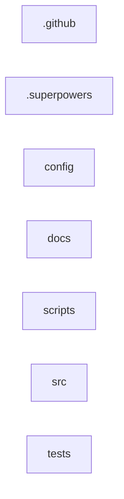

<!-- codemap: v0.2.0 -->
<!-- Generated by codemap — do not hand-edit. Edit annotations.yaml and regenerate. -->
# Code Map Guide

## .github

Roots: .github

## .superpowers

Roots: .superpowers

## config

Roots: config

## docs

Roots: docs

## scripts

Roots: scripts

## src

Roots: src

## tests

Roots: tests

